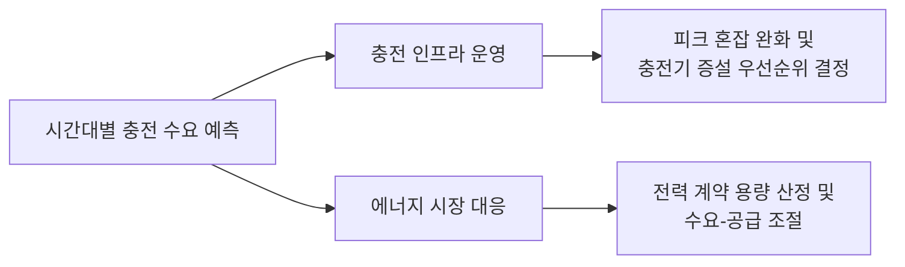

# EV Charging Demand Forecast

- 공공데이터 기반 시간대별 전기차 충전 수요 예측 및 운영 대시보드 구축

## 목차

- 👤 [개요](#-개요)
- ✅ [문제 정의](#-문제-정의)
- 💡 [가설 설정](#-가설-설정)
- 🔬 [실험 및 검증](#-실험-및-검증)
- 📊 [결론](#-결론)

---

## 👤 개요

- **개요**:
  - 전기차 충전 인프라는 빠르게 확대되고 있지만, 충전 수요는 시간대·요일·날씨에 따라 편차가 커서 정적인 운영 방식으로는 피크 시간대 혼잡에 대응하기 어렵습니다.
  - 본 프로젝트는 공공데이터 API로 수집한 충전 이력과 기상 데이터를 결합해, 시간 단위 충전 수요를 예측하는 모델을 Baseline부터 단계적으로 고도화했습니다.
- **기간/인원**: 2026.01 ~ 2026.06 (6개월) / 4명
- **주요 역할**:
  - 데이터 수집 파이프라인 설계 (공공데이터 API 비동기 병렬 수집)
  - XGBoost 모델링 및 Optuna 하이퍼파라미터 튜닝
  - Streamlit 운영 대시보드 배포
- **배운 점**:
  - 복잡한 모델 도입 전 반드시 Baseline 대비 성능 검증이 필요함을 실증적으로 확인
  - 시계열 데이터의 look-ahead bias 방지를 위한 분할 전략 설계 경험
  - 정확도 지표 외에 운영 관점의 지표(Peak_MAE)를 별도로 설계하는 감각 습득
  - 비동기(aiohttp) 처리 기반 대량 API 수집 파이프라인 구현 경험

---

## ✅ 문제 정의

- **왜 이 문제를 풀어야 하는가?**
  - 정적인 운영 방식으로는 시간대별 수요 편차에 대응할 수 없습니다.
  - 피크 시간대를 사전에 예측할 수 있다면, 충전 인프라 운영 효율을 높이고 확충 우선순위를 정량적으로 결정할 수 있습니다.
  - 충전 수요는 시간·요일·계절·날씨 등 다변량 요인의 영향을 받는 전형적인 시계열 예측 문제입니다.

---

## 💡 가설 설정

- **가설 1: 복잡한 모델(XGBoost)은 항상 단순 Baseline보다 우수할 것이다.**
  - 검증 방법: 24시간 이동평균 Baseline과 XGBoost 기본 모델의 R², RMSE를 동일 조건에서 비교
  - **결과: 기각.** Baseline(R²=0.270)이 XGBoost 기본 모델(R²=0.240)보다 우수했습니다.
  - 시간 변수만으로는 수요의 최근 패턴 의존성을 충분히 설명하지 못함을 시사합니다.

- **가설 2: 외부 변수(기상)와 하이퍼파라미터 튜닝을 추가하면 Baseline을 상회하는 성능을 확보할 수 있을 것이다.**
  - 검증 방법: Weather 변수 추가 및 Optuna 기반 하이퍼파라미터 탐색(TPE 샘플러) 후 최종 성능 비교
  - **결과: 채택.** 최종 모델이 R²=0.285로 Baseline과 초기 XGBoost 모두를 상회했습니다.

---

## 🔬 실험 및 검증

- **모델링 파이프라인**

- **데이터셋**
  - 학습 및 평가: 공공데이터포털 EV 충전 이력 API (약 60,000건, 비동기 병렬 수집)
  - 외부 변수: 기상청 시간 단위 기상 데이터
  - 분할: Train / Validation / Test = 60 / 20 / 20 (시계열 순서 보존, 데이터 누수 방지)

- **실험 1: Baseline vs 초기 XGBoost**

| Model | R² | RMSE (kWh) | 비고 |
|---|---|---|---|
| Baseline (24h 이동평균) | **0.270** | 63.47 | 단순 모델이 초기 XGBoost보다 우수 |
| XGBoost 기본 | 0.240 | 64.74 | 시간 변수만으로는 설명력 부족 |

- **실험 2: 최종 모델 성능**

| Model | R² | RMSE (kWh) | 비고 |
|---|---|---|---|
| Baseline (24h 이동평균) | 0.270 | 63.47 | 기준선 |
| XGBoost + Weather + Optuna (최종) | **0.285** | **62.45** | 베이스라인 대비 개선, 운영 배포 완료 |

- Baseline이 초기 XGBoost보다 우수했던 발견을 통해, 복잡한 모델 도입 전 반드시 베이스라인 대비 검증이 필요함을 확인했습니다.
- 이후 기상 변수와 Optuna 튜닝을 추가해 최종적으로 Baseline을 상회하는 성능을 확보했습니다.
- 정확도(R²) 외에 Peak_MAE(상위 20% 수요 구간 오차)를 별도로 평가해, 운영 관점에서 실제 의사결정에 활용 가능한 지표를 확보했습니다.

---

## 📊 결론

- **결론 1: Baseline 검증을 거친 점진적 모델 고도화**
  - 단순 이동평균 Baseline이 초기 XGBoost보다 우수했던 구간을 실증적으로 확인했습니다.
  - 이후 기상 변수와 Optuna 튜닝을 순차적으로 추가해 R² 0.270 → 0.285로 개선했습니다.
  - 기대효과: 데이터 특성에 대한 이해가 모델 복잡도보다 선행되어야 함을 실무 판단 기준으로 확보했습니다.
- **결론 2: 운영 관점의 End-to-End 파이프라인 구축**
  - 데이터 수집부터 대시보드 배포까지 실제 운영 가능한 형태로 완결했습니다.
  - 기대효과: 피크 시간대 사전 예측을 통해 충전 인프라 운영·확충 의사결정에 활용 가능한 정량적 근거를 제공합니다.
